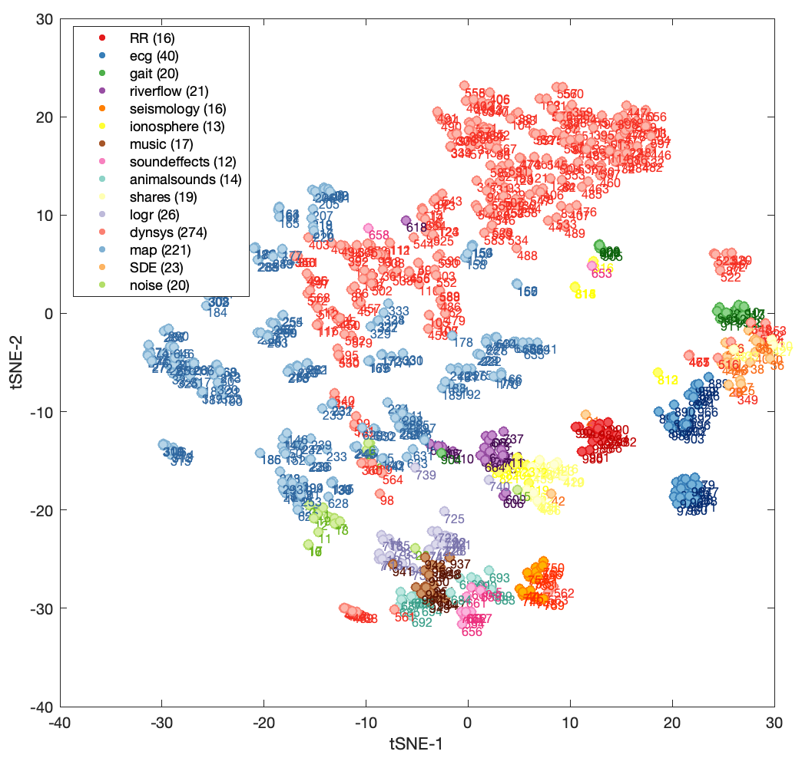

# Low-Dimensional Projection of Diverse Time Series
Generate a low-dimensional _t_-SNE projection of diverse time-series data

### Normalize and filter the Empirical1000 dataset
First we get a subselection of time series from the [Empirical 1000 dataset](https://doi.org/10.4225/03/59c88e1e51868).
Running `FilterAndNormalize` turns this original data file, `HCTSA.mat`, into the filtered and normalized file, `HCTSA_filtered_N.mat`.

### Run the low-dimensional projection
Run `DataProjection`, which yields the following plot:

Within some stochasticity of the _t_-SNE visualization, this is the plot shown in Fig. 1 of our paper, ['_CompEngine_: A self-organizing, living library of time-series data'](https://arxiv.org/abs/1905.01042).
